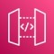

- 👋  Hi, I am Janic. I do open source software development

- 🔭 Personal Projects: [Chorely](https://chorely.app)

- 🤹 Skills & Experience: 

  - 🙠**Frontend**:           
  
  - 🔌  **Backend**:    ( )       , WebSockets
  
  - ☁️ **Cloud Hosting**:         

